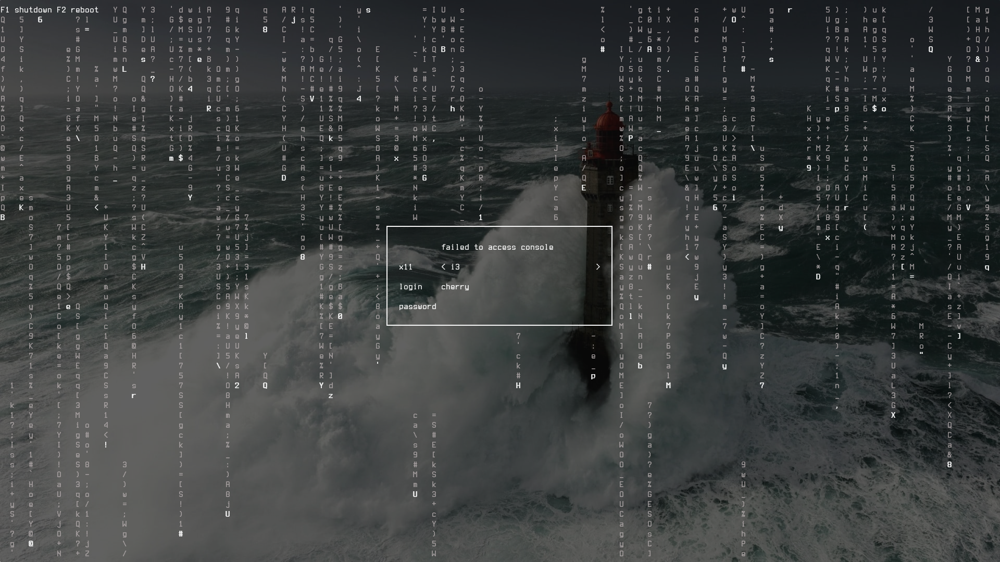
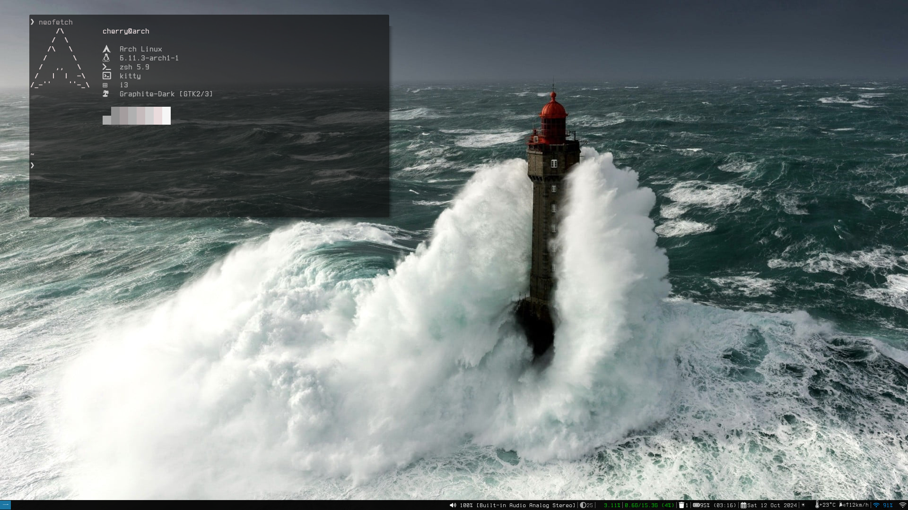
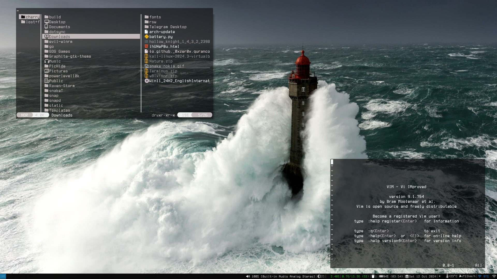
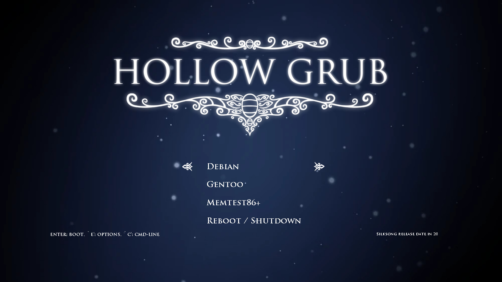

<h1 align="center">
      
    HI This is my Dotfiles :/
      
  </h1>
<p align="center">
  
  
</p>
  <br>
  <br>
  <h1 align="center">PREVIEW :)</h1>
  
  
  
  
 <br>
  <br>

## Project overview

This repository bundles a curated set of configuration files, themes, and assets to provide a ready-to-use, opinionated desktop environment based on i3 / polybar and related tools. The goal is to make a reproducible, easily deployable environment on Unix-like systems.

**Included components**
- Window manager: `i3`
- Status bars: `polybar`, `i3blocks`
- Terminal emulators: `kitty`
- Shell: `zsh` (`.zshrc`)
- Editor: `nvim` (Neovim configuration)
- Notification daemon: `dunst`
- Compositor: `picom`
- Rofi themes and configs
- Fastfetch / Neofetch configs
- GTK theme and icon assets
- GRUB theme (hollow-knight-grub-theme)
- Wallpapers and preview assets

---

## Supported systems & assumptions

This installer is designed to run on common Linux distributions (Arch-based, Debian/Ubuntu, Fedora/RHEL). It:
- Expects GNU coreutils, bash
- Detects package manager for informational guidance (it will **not** force package installs by default)
- Installs configuration files to standard XDG locations (e.g. `~/.config/*`)
- Creates backups of any overwritten files by default

---

## Security & Safety

- The installer never deletes user files without creating a timestamped backup directory (default: `~/.dotfiles_backup_<timestamp>`).
- Root operations are requested only when required (for example when copying a GRUB theme to `/boot/grub/themes`).
- Review the script before running. Prefer `--dry-run` on first execution.

---

## Quick install (recommended)

```bash
# clone
git clone https://github.com/0xjah/Dotfiles.git ~/Dotfiles
cd ~/Dotfiles

# make installer executable and run (dry-run first)
chmod +x install.sh
./install.sh --dry-run

# if output looks good, run for real
./install.sh --backup --symlink
```

---

## Features of the improved installer

- `--dry-run` : shows actions without making changes
- `--backup`  : create timestamped backup of existing config files
- `--symlink` : create symlinks instead of copying (safer for tracking with Git)
- `--force`   : overwrite without creating backup (use carefully)
- Idempotent: safe to run multiple times
- Per-component verbosity and logging to `/tmp/dotfiles-install.log`
- Distro detection and brief package suggestions (does **not** auto-install packages unless you enable it)

---

## Installation options & examples

- Create symlinks with backup:
```bash
./install.sh --backup --symlink
```

- Copy files (default), create backups:
```bash
./install.sh --backup
```

- Dry run to preview:
```bash
./install.sh --dry-run
```

- Force overwrite (no backups):
```bash
./install.sh --force
```

---

## Files layout (top-level)

- `.themes/` — GTK / window-theme assets  
- `i3/` — i3 configuration files  
- `polybar/` — polybar configuration and modules  
- `kitty/`, `alacritty/` — terminal configs  
- `nvim/` — Neovim config  
- `rofi/` — rofi themes and configs  
- `wallpapers/` — wallpaper assets  
- `install.sh` — improved installer script (this repo root copy)

---

## Post-install / Next steps

1. If you created symlinks, start a new shell or `source ~/.zshrc` to load shell changes.
2. Restart i3: `i3-msg restart` (or log out/in).
3. Rebuild GRUB (if you installed a GRUB theme) — on most systems:
   - Debian/Ubuntu: `sudo update-grub`
   - Arch: `sudo grub-mkconfig -o /boot/grub/grub.cfg`
4. If any package is missing (e.g., `polybar`, `alacritty`, `neovim`), install it using your distro package manager.

---

## Troubleshooting

- Permission errors when copying to `/boot` — run the installer with sudo where appropriate or allow the installer to call `sudo` only for the GRUB step.
- Missing fonts or icons — ensure `ttf-nerd-fonts` or equivalent packages are installed.
- GTK themes not applying — verify `gtk-3.0` directory was copied and your session is using the correct theme.

---

## Contributing

1. Fork the original repository.
2. Create a branch for your feature.
3. Submit a pull request with a clear description and testing steps.

---

  <a href="https://archlinux.org/" target="_blank">
    
  </a>
  <span style="margin: 0 10px;">||</span>
  <a href="https://i3wm.org/" target="_blank">
    
  </a>
</h1>
